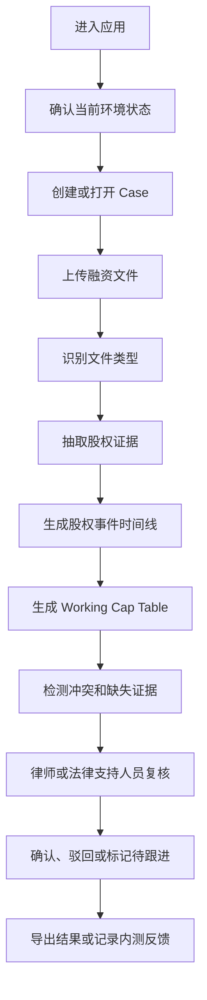

# 核心工作流

## Beta 标准工作流

## 工作台模型

Beta UX 应收敛为单页 Evidence Workspace。现有多个页面可以作为内部模块继续保留，但目标复核体验应在一个工作台内整合：

- AI Chat 面板：解释结果、回答上下文问题。
- Document Compare Canvas：展示文档正文、前后版本对比和来源高亮。
- History Pane：展示版本状态、拓扑摘要和 viewing version 切换。
- Document List Pane：展示上传文件和处理状态。
- Cap Table Snapshot Area：展示当前版本下的 working cap table。
- Evidence Review Queue：展示冲突、低置信度和需要人工复核的字段。

## 步骤说明

### 0. 进入与状态检查

输入：用户打开本地演示环境或受控测试环境。

输出：可进入的工作台，以及当前环境状态说明。

验收标准：

- 用户能看到当前 workspace 或 case 上下文。
- 用户能理解后端连接状态、模型状态，以及当前是否处于样例 / 演示模式。
- 如果系统不可用、模型未配置或后端未连接，界面必须说明影响范围与下一步动作。
- Beta 首屏应优先降低困惑，而不是先展示系统结构。

### 1. 创建或打开 Case

输入：用户打开默认工作台或创建一个融资项目。

输出：包含 case ID、空文件列表和初始状态的工作区。

验收标准：

- 用户知道当前正在处理哪个 case。
- 即使早期 Beta 简化实现，也要保证不同 case 的数据概念上隔离。

### 2. 上传融资文件

输入：一个或多个 DOCX 文件。

输出：上传后的文件记录和处理状态。

验收标准：

- 不支持的文件类型要有明确提示。
- 处理状态可见。
- 上传失败不能静默发生。
- 后端不可用、权限受限或文件不符合要求时，必须给出用户可理解的状态与建议动作。

### 3. 识别文件类型

输入：上传文件文本和元数据。

输出：文件类型、置信度，以及不确定时的候选类型。

验收标准：

- 低置信度分类进入复核状态。
- 用户最终应能查看并修正文件类型。

### 4. 抽取股权证据

输入：文档内容。

输出：关于主体、证券类型、日期、价格、股份数量、权利条款、审批事项等结构化证据。

验收标准：

- 每个关键字段包含来源文件引用。
- 每个关键字段包含置信度或复核状态。
- 缺少来源证据的关键字段不能被当作最终确认结果。
- 模型未配置、抽取失败或仅能使用本地规则时，必须向用户说明当前能力边界与恢复方式。

### 5. 生成股权事件时间线

输入：抽取后的证据。

输出：按时间排序的股权事件记录。

验收标准：

- 事件应尽量包含类型、日期、主体、证券、数量、金额、证据、置信度和复核状态。
- 日期或主体名称不明确时必须标记。

### 6. 生成 Working Cap Table

输入：已确认和草稿状态的股权事件。

输出：所选 viewing version 下的 working cap table 快照。

验收标准：

- 输出必须标记为工作草稿 / 复核辅助。
- 每个关键行链接到来源事件和来源证据。
- 历史版本切换后，cap table 展示同步更新。

### 7. 检测冲突和缺失证据

输入：文件记录、证据、事件时间线和 cap table 快照。

输出：冲突列表和复核队列。

验收标准：

- 冲突应包含原因、影响字段、证据链接和建议复核动作。
- 系统不得在没有人工复核的情况下自动解决法律冲突。

### 8. 人工复核

输入：抽取证据、冲突列表、cap table 行和来源文档。

输出：确认、驳回或待跟进状态。

验收标准：

- 人工决策需要记录。
- AI 生成结果必须与人工确认结果区分开。

## 关键状态

- `uploaded`：已上传。
- `processing`：处理中。
- `processed`：已处理。
- `processing_failed`：处理失败。
- `needs_review`：需要复核。
- `confirmed`：已确认。
- `rejected`：已驳回。
- `archived`：已归档。
- `merged`：已合并。

## 复核原则

产品应优先展示风险、冲突、证据和版本变化，而不是泛化摘要或静态数据看板。
Beta 优先减少用户困惑，而不是展示系统能力广度。
